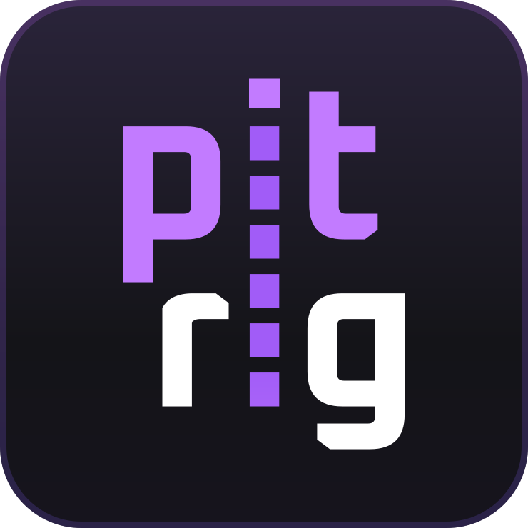
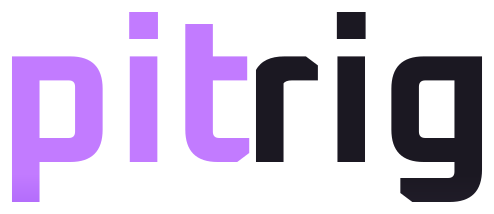

<p align="center">
  
</p>

<h1 align="center">
  <picture>
    <source media="(prefers-color-scheme: dark)" srcset="assets/branding/wordmark.svg">
    
  </picture>
</h1>

<p align="center">
  <b><a href="https://www.pitrig.com/flash">Flash a board</a></b> ·
  <b><a href="https://www.pitrig.com/download">Download the configurator</a></b> ·
  <b><a href="https://www.pitrig.com/docs">Guides</a></b>
</p>

Turn an off-the-shelf ESP32 board into a sim racing dashboard. Flash it from your
browser, lay the screen out by dragging widgets, and feed it live telemetry from
SimHub. No compiler, no soldering, no code.

Boards start at around $15. Everything here is open source.

Status: early development. The four boards below work end to end; buttons and
encoders are not implemented yet. What changed between versions, and what an
update costs a board that already holds a configuration, is in
[CHANGELOG.md](CHANGELOG.md).

## Quick start

**1. Flash the board.** Plug it in with a USB data cable, open the
[web flasher](https://www.pitrig.com/flash) in Chrome, Edge, Brave or
Opera, pick your board and press install. Each image carries one board identity,
so flash the one that matches the hardware in front of you. A first flash erases
whatever is already on the board.

**2. Design the dashboard.** Install the configurator, connect the board over the
same cable, and start from one of the four bundled dashboards or an empty
screen. Drag widgets, bind them to telemetry, preview the result, and save to the
board. macOS does not yet get signed packages, so run
`xattr -dr com.apple.quarantine` on the app once after installing.

**3. Connect SimHub.** Export a profile from the configurator's SimHub panel,
import it in SimHub under Custom Serial Devices, select the Pitrig port and
start the game. Close the configurator first — one serial port admits one
process.

## Supported boards

| Board | Screen | Touch | Chip | Free GPIOs |
| --- | --- | --- | --- | --- |
| LilyGO T-Display-S3 | 1.9" · 320 × 170 | no | ESP32-S3 | 10 |
| Guition ESP32-4848S040 | 4" square · 480 × 480 | yes | ESP32-S3 | 5 |
| Guition JC1060P470C | 7" wide · 1024 × 600 | yes | ESP32-P4 | 11 |
| Espressif ESP32-S3-DevKitC-1 | none | — | ESP32-S3 | 16 |

The DevKitC-1 has no display and carries no dashboard; it is for LED strips,
matrices and bring-up work. The 4848S040 talks at 460800 baud because its CH340
bridge does not hold 921600 — the exported SimHub profile already accounts for
this.

## What it can show

- **Widgets** — text, arcs, bars, indicator strips, graphs, images and shaped
  containers, composed freely on the screen.
- **228 telemetry fields** from SimHub: RPM, speed, gear, deltas, fuel, tyres,
  flags, session state and the rest of the catalogue.
- **Conditional styling** — colour ramps, gradients, visibility and blink driven
  by the values themselves, so a readout goes red on its own.
- **Multiple screens** with swipe navigation on the touch boards, and slots that
  switch what an area shows.
- **Addressable LEDs** — WS2812B and SK6812 strips and matrices, with layered
  effects and artwork drawn in the configurator.
- **Lap timer** and value smoothing, which keeps needles moving between packets
  when SimHub Free caps the feed at 10 Hz.
- **Your own fonts and images**, uploaded to the board and packed for it.

Updates arrive over the air: the configurator uploads new firmware over the same
cable, and applying a configuration does not restart the board.

## Documentation

Guides for using Pitrig live on [the site](https://www.pitrig.com/docs):
flashing, the configurator, and connecting SimHub.

Reference material lives here:
[device configuration](docs/device-configuration.md),
[dashboard widgets](docs/dashboard-widgets.md),
[control protocol](docs/control-protocol.md),
[SimHub telemetry](docs/simhub-custom-serial.md), the
[SimHub plugin](docs/simhub-plugin.md) and the
[telemetry catalogue](docs/telemetry-catalog.md).

## Build from source

The firmware is ESP-IDF and C++20; the configurator is Electron, React and
TypeScript.

```sh
source tools/idf-env.sh firmware/build-t-display
cd firmware
idf.py -B build-t-display \
  -DIDF_TARGET=esp32s3 \
  -DSDKCONFIG=sdkconfig.generated.t-display \
  -DSDKCONFIG_DEFAULTS="sdkconfig.defaults;sdkconfig.defaults.t-display-s3" \
  build
```

```sh
cd configurator
pnpm install
pnpm run dev
```

[CLAUDE.md](CLAUDE.md) carries the build command for every board, the generated
contracts and the checks; [AGENTS.md](AGENTS.md) is the working agreement and
[docs/architecture.md](docs/architecture.md) explains the layering. Design
decisions are recorded in [docs/adr/](docs/adr).

`pnpm run dev:debug` starts a separate debug application from the same package —
serial console, telemetry bench, firmware upload and raw document editing.

## Contact

Questions, bug reports and hardware requests: [contact.pitrig@gmail.com](mailto:contact.pitrig@gmail.com).

## Licence

Copyright (c) 2026 Illia Lukashchuk

The firmware, the configurator and the tooling are licensed under the **GNU General Public License,
version 3 or later** — see [LICENSE](LICENSE). A device that ships a modified Pitrig firmware has to
publish those modifications and leave the board reflashable.

The interfaces a device speaks are licensed under the **Apache License 2.0** instead, so that anyone
may implement a compatible client, tool or firmware without adopting a copyleft licence — see
[LICENSE-APACHE](LICENSE-APACHE). That covers:

| Path | What it defines |
| --- | --- |
| [configuration/](configuration) | The configuration schema every document is validated against |
| [telemetry/](telemetry) | The telemetry catalogue and the SimHub property mappings |
| [simhub/](simhub) | The generated SimHub Custom Serial profile |
| [docs/](docs) | The control protocol, the schema reference and the architecture records |

Pitrig is a name, not just code: the licences above cover the source, not the brand. What may be
done with the name and the logo is in [TRADEMARK.md](TRADEMARK.md).

## Contributing

[CONTRIBUTING.md](CONTRIBUTING.md) has what to read first, how to check a change and how to send it.
Every commit needs a sign-off certifying the [Contributor Licence Agreement](CLA.md).
